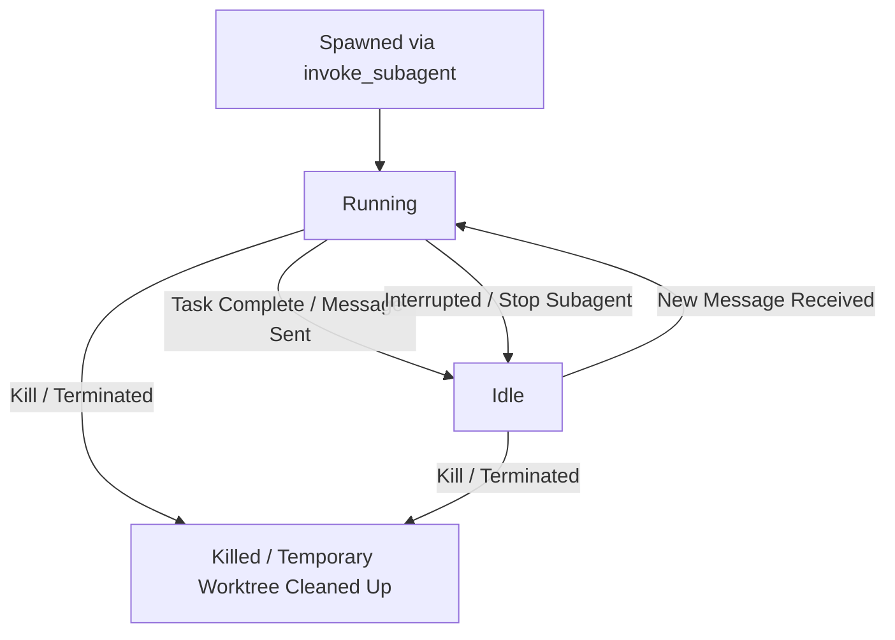

# Working with Antigravity Subagents

This skill provides instructions, architectural guidelines, and best practices for defining, invoking, and managing subagents in Antigravity.

## When to Use This Skill
Use this skill when:
- The user requests to create or run tasks using subagents.
- You need to parallelize complex tasks (e.g., executing test suites while writing code).
- You want to perform extensive, search-heavy codebase exploration without polluting your main conversation context.
- You need to coordinate teamwork across multiple specialized agents.

---

## Architecture of Subagents

Subagents run asynchronously in the background. They execute tasks concurrently, starting with an isolated context window (but inheriting the same LLM configuration and workspace access/permissions).

### Workspace Modes
When invoking a subagent, you can specify its workspace mode:
- **`inherit`**: Shares the parent agent's exact workspace.
- **`branch`**: Creates an isolated Git worktree branched from the parent workspace. Use this when the subagent needs to perform operations that could conflict with the parent's work (e.g., trying a risky refactoring).
- **`share`**: Creates a workspace sharing the parent's repository directory (like a Git worktree), allowing independent branching without duplicating storage.

---

## Subagent Lifecycle and States

At any point, a subagent exists in one of three states:

1. **Running**: Actively executing code, invoking tools, and thinking. Can be interrupted by sending a message or stopped by the user.
2. **Idle**: The subagent has finished its task and sent a message with results to the parent. It is suspended but retains its conversation context. Sending a new message to it re-awakens it to the **Running** state.
3. **Killed**: Permanently terminated. Any temporary Git worktrees are cleaned up, but historical transcripts remain visible.

---

## Inter-Agent Communication

Agents communicate with each other using the `send_message` tool.
- **Auto-Wake**: Sending a message to an **Idle** agent automatically resumes its execution.
- **Flexible Routing**: If an agent knows the ID of another active agent, it can send messages to it (not restricted only to direct parents/children).
- **Shared Transcripts**: Agents can inspect other agents' conversation transcripts to coordinate state and understand progress.

---

## Defining and Invoking Subagents

### 1. Built-In Subagents
Antigravity provides pre-configured subagents:
- **`research`**: Specialized read-only agent for codebase exploration and web searching.
- **`self`**: A direct clone of the calling agent, sharing the system prompt and toolsets.

### 2. Defining Custom Subagents
You can define specialized subagents dynamically using the `define_subagent` tool:
- **`name`**: Unique identifier for invocation.
- **`system_prompt`**: Instructions defining the subagent's role, constraints, and behavior.
- **`enable_write_tools`**: Grant file editing and command execution capabilities.
- **`enable_subagent_tools`**: Grant the ability to define/invoke further subagents.
- **`enable_mcp_tools`**: Allow the subagent to use connected Model Context Protocol servers.

### 3. Invoking Subagents
Once a custom subagent is defined (or when using a built-in one), spawn it using the `invoke_subagent` tool, specifying the `TypeName`, `Role`, `Prompt` (initial task description), and optional `Workspace` mode.

---

## Constraints and Permissions

### 1. Nesting Limit
A maximum nesting depth of **10 levels** of subagents is strictly enforced to prevent infinite loops and runaway resource consumption.

### 2. Scoped Permissions
Subagents inherit the parent's security context:
- Inherited allowed command prefixes and file paths.
- If a subagent attempts an action requiring user approval, the permission request bubbles up to the user interface.

---

## Best Practices for Subagent Orchestration

### 1. Keep Context Clean
Delegate heavy search, compilation, or test-running tasks to a `research` or `self` subagent. The subagent will do the heavy lifting and return a concise summary, keeping the parent's context window small and responsive.

### 2. Prefer Reusing Subagents
Instead of calling `invoke_subagent` repeatedly to launch new instances, send a message using `send_message` to an existing **Idle** subagent to give it a follow-up task. This preserves context and saves setup overhead.

### 3. Provide Clear, Scoped Goals
When invoking a subagent, provide a precise initial prompt describing the exact task and what format the output should take. For custom subagents, write a system prompt focused strictly on their specialized role.
